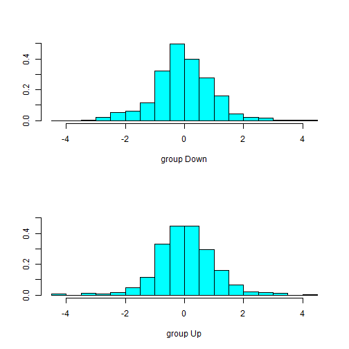
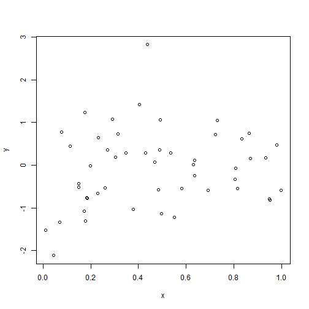
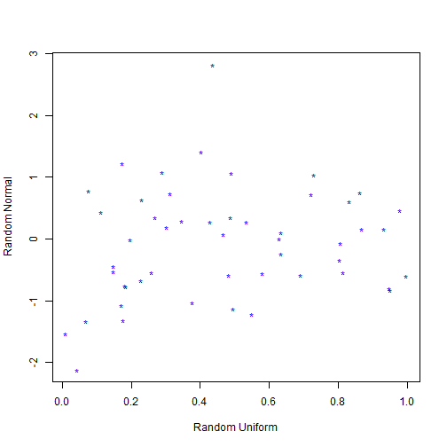
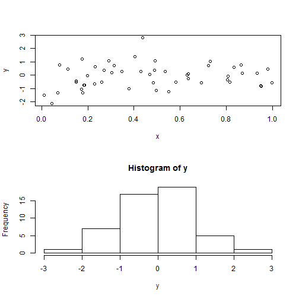

Chapter 02. Introduction To R
========================================================
### Feathers
#### 1. Good at data analysis
#### 2. It is totally free
#### 3. Lots of built-in packages
#### 4. Beautiful graphics 

***
### 01. Basic command


```r
### vectors, data, matrices, subsetting
x = c(2, 7, 5)
x
```

```
## [1] 2 7 5
```

```r
y = seq(from = 4, length = 3, by = 3)
`?`(seq)
```

```
## starting httpd help server ... done
```

```r
y
```

```
## [1]  4  7 10
```

```r
### vector operations in parallel
x + y
```

```
## [1]  6 14 15
```

```r
### element-wise division
x/y
```

```
## [1] 0.5 1.0 0.5
```

```r
x^y
```

```
## [1]      16  823543 9765625
```

```r
x[2]
```

```
## [1] 7
```

```r
x[2:3]
```

```
## [1] 7 5
```

```r
### Use '-' to remove elements
x[-2]
```

```
## [1] 2 5
```

```r
### Remove the collection of indices 1 and 2,
x[-c(1, 2)]
```

```
## [1] 5
```

```r
### Matrix : two way array
z = matrix(seq(1, 12), 4, 3)
z
```

```
##      [,1] [,2] [,3]
## [1,]    1    5    9
## [2,]    2    6   10
## [3,]    3    7   11
## [4,]    4    8   12
```

```r
### Subset matrix
z[3:4, 2:3]
```

```
##      [,1] [,2]
## [1,]    7   11
## [2,]    8   12
```

```r
z[, 2:3]
```

```
##      [,1] [,2]
## [1,]    5    9
## [2,]    6   10
## [3,]    7   11
## [4,]    8   12
```

```r
### When we took just the first column of z, that became a vector
z[, 1]
```

```
## [1] 1 2 3 4
```

```r
### Use drop=FALSE to keep it as matrix
z[, 1, drop = FALSE]
```

```
##      [,1]
## [1,]    1
## [2,]    2
## [3,]    3
## [4,]    4
```

```r
### Dimensions of the matrix.
dim(z)
```

```
## [1] 4 3
```

```r
### Tell you what you have available in your working directory.
ls()
```

```
## [1] "x" "y" "z"
```

```r
### Use rm to clean up your working directory
rm(y)
ls()
```

```
## [1] "x" "z"
```

***

***
### 02. Generate data and Simulation


```r
### Generating random data, graphics
`?`(runif)
### random uniform
x = runif(50)
### random Gaussion
y = rnorm(50)
plot(x, y)
```

 


***
### 03. Plotting
#### One doesn't think too much about the design of graphics, but a lot goes into it, such as aspect ratios, how much space to put around the points on a plot, between the edge of the points and the axes. Just things like spacing of the axes, how many ticks, and so on


```r
plot(x, y)
```

 

```r
plot(x, y, xlab = "Random Uniform", ylab = "Random Normal", pch = "*", col = "blue")
```

 

```r
### a panel of plots with two rows and one column.
par(mfrow = c(2, 1))
plot(x, y)
hist(y)
```

 

```r
### reset it with another mfrow command.
par(mfrow = c(1, 1))
```

***

***
### 04. Reading in data


```r
### Reading in data Auto=read.csv('Auto.csv') pwd()
### Auto=read.csv('../Auto.csv') names(Auto) dim(Auto) Data frame It's sort of
### like a matrix, except that the columns can ### be variables of different
### kinds. So you can have what ### we call factors, and continuous variables,
### and matrices, and so on, which is really the way we think ### of
### observations in statistics.

# class(Auto) summary(Auto)

### Data frame is also a list. getting the element of a list we can use $
### plot(Auto$cylinders,Auto$mpg) plot(Auto$cyl,Auto$mpg) atach creates a
### workspace with all the named variables as ### now variables in your
### workspace.So now you can access them ### by name.  attach(Auto)

### command Search, it tells us our various workspaces.  search()
### plot(cylinders,mpg) cylinders=as.factor(cylinders)
### plot(cylinders,mpg,xlab='Cylinders',ylab='Mpg',col='red')
### pdf(file='../mpg.pdf')
### plot(cylinders,mpg,xlab='Cylinders',ylab='Mpg',col='red') dev.off()
### pairs(Auto,col='brown') pairs(mpg~cylinders+acceleration+weight,Auto) q()
```


***
