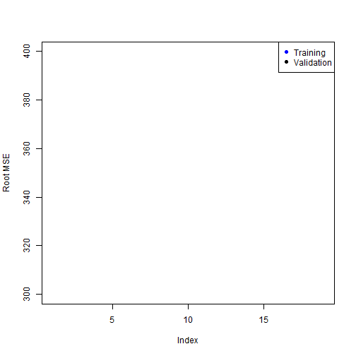

Model Selection
================

This is an R Markdown document. Markdown is a simple formatting syntax for authoring web pages,
and a very nice way of distributing an analysis. It has some very simple syntax rules.


```r
library(ISLR)
```

```
## Error: there is no package called 'ISLR'
```

```r
summary(Hitters)
```

```
## Error: object 'Hitters' not found
```

There are some missing values here, so before we proceed we will remove them:


```r
Hitters = na.omit(Hitters)
```

```
## Error: object 'Hitters' not found
```

```r
with(Hitters, sum(is.na(Salary)))
```

```
## Error: object 'Hitters' not found
```


Best Subset regression
------------------------
We will now use the package `leaps` to evaluate all the best-subset models.

```r
library(leaps)
```

```
## Error: there is no package called 'leaps'
```

```r
regfit.full = regsubsets(Salary ~ ., data = Hitters)
```

```
## Error: could not find function "regsubsets"
```

```r
summary(regfit.full)
```

```
## Error: object 'regfit.full' not found
```

It gives by default best-subsets up to size 8; lets increase that to 19, i.e. all the variables

```r
regfit.full = regsubsets(Salary ~ ., data = Hitters, nvmax = 19)
```

```
## Error: could not find function "regsubsets"
```

```r
reg.summary = summary(regfit.full)
```

```
## Error: object 'regfit.full' not found
```

```r
names(reg.summary)
```

```
## Error: object 'reg.summary' not found
```

```r
plot(reg.summary$cp, xlab = "Number of Variables", ylab = "Cp")
```

```
## Error: object 'reg.summary' not found
```

```r
which.min(reg.summary$cp)
```

```
## Error: object 'reg.summary' not found
```

```r
points(10, reg.summary$cp[10], pch = 20, col = "red")
```

```
## Error: object 'reg.summary' not found
```

There is a plot method for the `regsubsets`  object

```r
plot(regfit.full, scale = "Cp")
```

```
## Error: object 'regfit.full' not found
```

```r
coef(regfit.full, 10)
```

```
## Error: object 'regfit.full' not found
```


Forward Stepwise Selection
--------------------------
Here we use the `regsubsets` function but specify the `method="forward" option:

```r
regfit.fwd = regsubsets(Salary ~ ., data = Hitters, nvmax = 19, method = "forward")
```

```
## Error: could not find function "regsubsets"
```

```r
summary(regfit.fwd)
```

```
## Error: object 'regfit.fwd' not found
```

```r
plot(regfit.fwd, scale = "Cp")
```

```
## Error: object 'regfit.fwd' not found
```


Model Selection Using a Validation Set
---------------------------------------
Lets make a training and validation set, so that we can choose a good subset model.
We will do it using a slightly different approach from what was done in the the book.

```r
dim(Hitters)
```

```
## Error: object 'Hitters' not found
```

```r
set.seed(1)
train = sample(seq(263), 180, replace = FALSE)
train
```

```
##   [1]  70  98 150 237  53 232 243 170 161  16 259  45 173  97 192 124 178
##  [18] 245  94 190 228  52 158  31  64  92   4  91 205  80 113 140 115  43
##  [35] 244 153 181  25 163  93 184 144 174 122 117 251   6 104 241 149 102
##  [52] 183 224 242  15  21  66 107 136  83 186  60 211  67 130 210  95 151
##  [69]  17 256 207 162 200 239 236 168 249  73 222 177 234 199 203  59 235
##  [86]  37 126  22 230 226  42  11 110 214 132 134  77  69 188 100 206  58
## [103]  44 159 101  34 208  75 185 201 261 112  54  65  23   2 106 254 257
## [120] 154 142  71 166 221 105  63 143  29 240 212 167 172   5  84 120 133
## [137]  72 191 248 138 182  74 179 135  87 196 157 119  13  99 263 125 247
## [154]  50  55  20  57   8  30 194 139 238  46  78  88  41   7  33 141  32
## [171] 180 164 213  36 215  79 225 229 198  76
```

```r
regfit.fwd = regsubsets(Salary ~ ., data = Hitters[train, ], nvmax = 19, method = "forward")
```

```
## Error: could not find function "regsubsets"
```

Now we will make predictions on the observations not used for training. We know there are 19 models, so we set up some vectors to record the errors. We have to do a bit of work here, because there is no predict method for `regsubsets`.

```r
val.errors = rep(NA, 19)
x.test = model.matrix(Salary ~ ., data = Hitters[-train, ])  # notice the -index!
```

```
## Error: object 'Hitters' not found
```

```r
for (i in 1:19) {
    coefi = coef(regfit.fwd, id = i)
    pred = x.test[, names(coefi)] %*% coefi
    val.errors[i] = mean((Hitters$Salary[-train] - pred)^2)
}
```

```
## Error: object 'regfit.fwd' not found
```

```r
plot(sqrt(val.errors), ylab = "Root MSE", ylim = c(300, 400), pch = 19, type = "b")
points(sqrt(regfit.fwd$rss[-1]/180), col = "blue", pch = 19, type = "b")
```

```
## Error: object 'regfit.fwd' not found
```

```r
legend("topright", legend = c("Training", "Validation"), col = c("blue", "black"), 
    pch = 19)
```

 

As we expect, the training error goes down monotonically as the model gets bigger, but not so 
for the validation error.

This was a little tedious - not having a predict method for `regsubsets`. So we will write one!

```r
predict.regsubsets = function(object, newdata, id, ...) {
    form = as.formula(object$call[[2]])
    mat = model.matrix(form, newdata)
    coefi = coef(object, id = id)
    mat[, names(coefi)] %*% coefi
}
```


Model Selection by Cross-Validation
-----------------------------------
We will do 10-fold cross-validation. Its really easy!

```r
set.seed(11)
folds = sample(rep(1:10, length = nrow(Hitters)))
```

```
## Error: object 'Hitters' not found
```

```r
folds
```

```
## Error: object 'folds' not found
```

```r
table(folds)
```

```
## Error: object 'folds' not found
```

```r
cv.errors = matrix(NA, 10, 19)
for (k in 1:10) {
    best.fit = regsubsets(Salary ~ ., data = Hitters[folds != k, ], nvmax = 19, 
        method = "forward")
    for (i in 1:19) {
        pred = predict(best.fit, Hitters[folds == k, ], id = i)
        cv.errors[k, i] = mean((Hitters$Salary[folds == k] - pred)^2)
    }
}
```

```
## Error: could not find function "regsubsets"
```

```r
rmse.cv = sqrt(apply(cv.errors, 2, mean))
plot(rmse.cv, pch = 19, type = "b")
```

```
## Warning: no non-missing arguments to min; returning Inf
## Warning: no non-missing arguments to max; returning -Inf
```

```
## Error: need finite 'ylim' values
```

 


Ridge Regression and the Lasso
-------------------------------
We will use the package `glmnet`, which does not use the model formula language, so we will set up an `x` and `y`.

```r
library(glmnet)
```

```
## Loading required package: Matrix
## Loaded glmnet 1.9-5
```

```r
x = model.matrix(Salary ~ . - 1, data = Hitters)
```

```
## Error: object 'Hitters' not found
```

```r
y = Hitters$Salary
```

```
## Error: object 'Hitters' not found
```

First we will fit a ridge-regression model. This is achieved by calling `glmnet` with `alpha=0` (see the helpfile). There is also a `cv.glmnet` function which will do the cross-validation for us. 

```r
fit.ridge = glmnet(x, y, alpha = 0)
```

```
## Error: error in evaluating the argument 'x' in selecting a method for function 'drop': Error: object 'y' not found
```

```r
plot(fit.ridge, xvar = "lambda", label = TRUE)
```

```
## Error: object 'fit.ridge' not found
```

```r
cv.ridge = cv.glmnet(x, y, alpha = 0)
```

```
## Error: object 'x' not found
```

```r
plot(cv.ridge)
```

```
## Error: object 'cv.ridge' not found
```

Now we fit a lasso model; for this we use the default `alpha=1`

```r
fit.lasso = glmnet(x, y)
```

```
## Error: error in evaluating the argument 'x' in selecting a method for function 'drop': Error: object 'y' not found
```

```r
plot(fit.lasso, xvar = "lambda", label = TRUE)
```

```
## Error: object 'fit.lasso' not found
```

```r
cv.lasso = cv.glmnet(x, y)
```

```
## Error: object 'x' not found
```

```r
plot(cv.lasso)
```

```
## Error: object 'cv.lasso' not found
```

```r
coef(cv.lasso)
```

```
## Error: object 'cv.lasso' not found
```


 Suppose we want to use our earlier train/validation division to select the `lambda` for the lasso.
 This is easy to do.

```r
lasso.tr = glmnet(x[train, ], y[train])
```

```
## Error: error in evaluating the argument 'x' in selecting a method for function 'drop': Error: object 'y' not found
```

```r
lasso.tr
```

```
## Error: object 'lasso.tr' not found
```

```r
pred = predict(lasso.tr, x[-train, ])
```

```
## Error: object 'lasso.tr' not found
```

```r
dim(pred)
```

```
## Error: object 'pred' not found
```

```r
rmse = sqrt(apply((y[-train] - pred)^2, 2, mean))
```

```
## Error: object 'y' not found
```

```r
plot(log(lasso.tr$lambda), rmse, type = "b", xlab = "Log(lambda)")
```

```
## Error: object 'lasso.tr' not found
```

```r
lam.best = lasso.tr$lambda[order(rmse)[1]]
```

```
## Error: object 'lasso.tr' not found
```

```r
lam.best
```

```
## Error: object 'lam.best' not found
```

```r
coef(lasso.tr, s = lam.best)
```

```
## Error: object 'lasso.tr' not found
```

